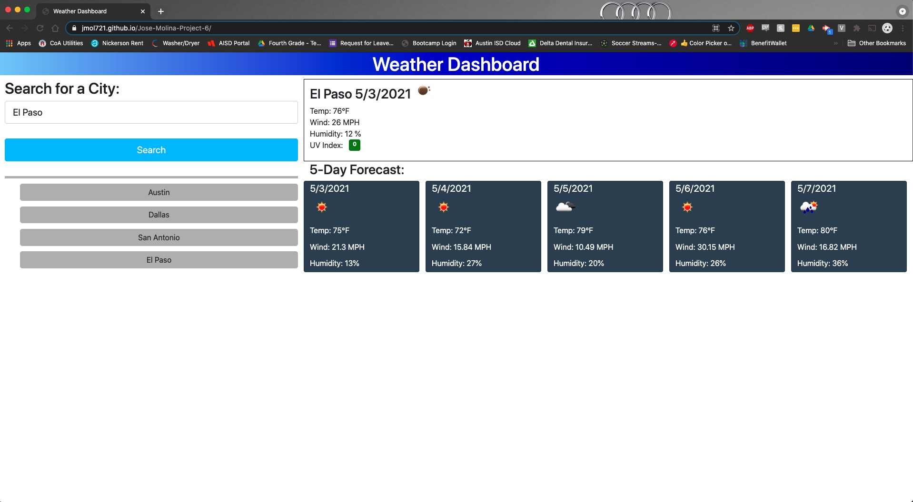

# Jose-Molina-Project-6

This app lets you see the weather forecast for multiple cities all while displaying the current conditions. It will keep track of your search history and will allow you to click the cities and view the forecast of those. It will use local storage to store the cities you have already looked for. There will be a color indicator that shows whether conditions are favorable or not.

Repo Url:
https://github.com/jmol721/Jose-Molina-Project-6

Deployed App Url:
https://jmol721.github.io/Jose-Molina-Project-6/

Screenshots:

